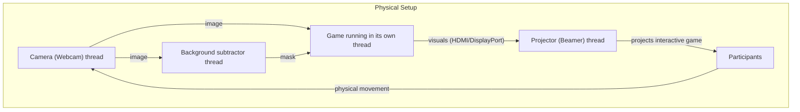

# Platos Beamer

Camera-based silhouette tracking game engine

## Motivation

This project is about creating a situation akin to Plato's Cave for the players. The input is their shapes and we're going to project points with a beamer onto them, which they can interact with.

It's named after the philosophical concept Plato came up with, called [Plato's Cave](https://en.wikipedia.org/wiki/Allegory_of_the_cave).


---

## Table of Contents

- [Introduction](#introduction)
- [Features](#features)
- [Game Modes](#game-modes)
- [Silhouette Detection Modes](#silhouette-detection-modes)
- [Skull Game Example](#skull-game-example)
- [Installation](#installation)
- [Building](#building)
- [Usage](#usage)
- [Configuration](#configuration)
- [System Setup](#system-setup)
- [Engine Architecture & Custom Games](#engine-architecture--custom-games)
- [Contributing](#contributing)
- [License](#license)

---

## Introduction

**Platos Beamer** is an interactive computer vision engine inspired by Plato's Allegory of the Cave. It uses a camera and a projector (beamer) to create playful experiences: silhouettes are detected, and interactive game elements are projected. Participants can physically interact with these projections, turning their shadows into part of the game.

While the "Skull Game" is a featured example, the main focus of the project is the **engine** itself, which supports multiple game modes and advanced silhouette detection techniques.

---

## Features

- **Live silhouette detection** using computer vision (OpenCV).
- **Interactive projections**: project game elements onto detected silhouettes.
- **Extensible engine architecture** supporting multiple game modes.
- **Written in Rust** using Glium (OpenGL) for graphics.
- **Multiple silhouette detection algorithms** (see below).
- **Easy addition of new games** via the game engine's modular system.

---

## Game Modes

The `src/game` folder contains examples of different games that run on the engine:

- **Skull Game**: Example game—targets ("Skulls") appear on silhouettes and can be destroyed by movement. Includes rounds, intermissions, and win/loss logic.
- **Identity Game**: Projects the detected silhouettes directly for calibration or fun mirror effects.
- **Calibration Game**: A mode for calibrating the system and adjusting camera/projector alignment.

You can add your own game modes by following the modular game trait system defined in the engine.

---

## Silhouette Detection Modes

The engine supports multiple silhouette/background subtraction algorithms, making it robust in different environments:

- **Naive Subtractor**: Simple pixel-by-pixel difference between background and input images, using channel thresholds.
- **MOG Subtractor**: Uses the Mixture Of Gaussians algorithm to subtract the background.
- **Optical Flow Subtractor**: Uses movement between frames to detect changing silhouettes, robust against lighting changes. This doesn't track the silhouette but rather movement.
- **Test Subtractor**: A mode for testing detection logic, useful for debugging and development.

These modes are selectable via configuration and can be extended for new detection strategies.

---

## Skull Game Example

The **Skull Game** is the main showcase example for the Platos Beamer engine. It demonstrates how interactive games can be built using the engine's capabilities.

### Gameplay

Skulls (targets) appear projected onto the silhouettes of participants. The goal is to "destroy" these skulls. This can be acomplished by a vertical movement, that spawns bulletts, that fly upwards.

### How To Try

- Select "Skull Game" as the game mode in your configuration.
- Run the engine and let participants interact with the projected skulls!

---

## Installation

### Prerequisites

- **Rust toolchain** ([Install Rust](https://rustup.rs))
- **OpenCV** (system library)
- **A Linux system** (Nix supports the development environment)
- **A webcam** (for capturing silhouettes)
- **A projector/beamer** (for projecting game visuals)

### Clone the Repository

```bash
git clone https://github.com/Fluffy8unny/platos_beamer.git
cd platos_beamer
```

### Install Dependencies (Recommended: Devenv)

If you use [Nix](https://nixos.org) and [Devenv](https://devenv.new/), a `devenv.nix` file is provided:

```bash
devenv shell
cargo run
```

This sets up the required Rust and C/OpenCV environment.

Otherwise, ensure you have Rust and OpenCV installed on your system.

---

## Building

Ensure your system has OpenCV installed and available to Rust (see [opencv-rust](https://github.com/twistedfall/opencv-rust) for details).
Build the project using Cargo:

```bash
cargo build --release
```

To run the project:

```bash
cargo run --release
```

---

## Usage

### Setup

1. **Connect your webcam** and point it at the area where participants will play.
2. **Set up your projector** so it overlays the play area.
3. **Run the application**:

    ```bash
    cargo run --release
    ```

4. The engine will start and load the selected game mode:
    - It will capture silhouettes from the camera feed.
    - Project game elements onto detected silhouettes.
    - Participants interact with the projections.
___

### Default keybinds
    - **s** call **`start`** function of the currently running game
    - **r** cal **`reset`** function of the currently running game
    - **m** toggle minimap modes, that display either the video input or the mask output
---

## System Setup

Below is a diagram of the typical hardware setup for Platos Beamer, showing the data flow:



- The **Camera** captures the live image of the participants and provides it to both the **Subtractor** (for mask creation) and directly to the **Game** logic for real-time display.
- The **Subtractor** processes the image, computes the mask (silhouette), and provides the mask data to the **Game**.
- The **Game Engine** uses both image and mask to run the selected game mode, generating visual output for the **Beamer/Projector**.
- The **Display** projects the visuals onto the play area, where participants interact.
- The **Participants** interact with the game, and their movements are captured by the camera, closing the feedback loop.

---

## Engine Architecture & Custom Games

### GameTrait Overview

The core of the engine's extensibility is the `GameTrait` interface (Rust trait), which every game mode implements. This trait defines the main lifecycle and data interactions for a game:

- **`init`**: Initialize resources, load shaders and textures, set up game state.
- **`update`**: Receive new image data and mask (from camera and background subtraction). Use these to update game logic and state.
- **`draw`**: Render the current frame using Glium/OpenGL. This is what gets projected.
- **`key_event`**: Handle keyboard input to control the game (e.g., start, difficulty).
- **`reset`**: Reset the game state for a new round or after victory/defeat.

#### Implementing a Custom Game

To add your own game mode:

1. **Create a new module** in `src/game/your_game/`.
2. **Define a struct** for your game's state.
3. **Implement the `GameTrait`** for your struct. At minimum, you'll need:
    - `init` to set up graphics, sound, and state.
    - `update` to process incoming images and masks.
    - `draw` to render your custom visuals.
    - `key_event` for controls.
    - `reset` for round management.
4. **Register your game mode** in the engine (see `main.rs`).
5. **Configure your game** in the TOML configuration files.

You can use both the raw images and silhouette masks to drive your game logic, making it easy to create new interactive experiences that leverage physical movement and computer vision.

### Implementing a Custom Subtractor

If you want to add a new silhouette/background subtraction method, implement the engine's `BackgroundSubtractor` trait and register your subtractor in the background-subtractor selector (the pipeline). The repo already includes examples you can follow: `src/bg_subtract/naive.rs`, `src/bg_subtract/of.rs`, and `src/bg_subtract/test.rs`.

Key points:
- The trait requires two methods:
  - `apply(&mut self, input_img: Mat) -> Result<MatExpr>` — produce a mask (MatExpr) from the input image.
  - `reset(&mut self, background_img: Mat)` — optional: reinitialize internal state with a background image.
- Use OpenCV types (`opencv::core::Mat`, `MatExpr`) and return `opencv::Result<...>`.
- Keep any persistent state (e.g., `prev_img` for optical flow) inside your subtractor struct.

---

## Contributing

Contributions are welcome! Please open an issue or submit a pull request.

---

## License

MIT License © 2025 Andreas Weissenburger

See [LICENSE](LICENSE) for details.

---
